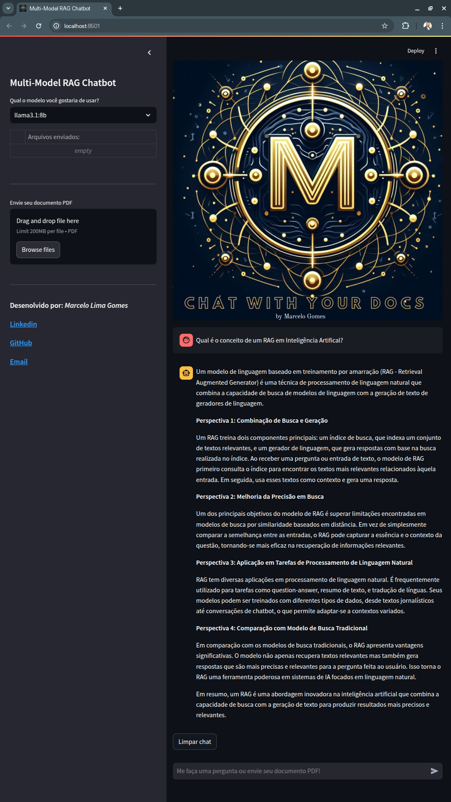

## Apresentação
Olá, me chamo Marcelo. Seja bem-vindo ao meu repositório git, o qual utilizo para compartilhar minha jornada de aprendizado em Data Science, Machine Learning e Inteligência Artificial.Neste repositório irei compartilhar minhas atividades construídas durante a Pós Graduação na FIAP - IA para Devs

### Aceito sugestões!
#### Convido vocês a se conectarem comigo no LinkedIn:
[Linkedin: Marcelo Lima Gomes](https://www.linkedin.com/in/marcelolimagomes)

[E-mail: marcelolimagomes@gmail.com](mailto:marcelolimagomes@gmail.com)

## Visão Geral

Esta aplicação é um MVP (Minimum Viable Product) desenvolvido para demonstrar o conceito de IA Generativa e Recuperação Aumentada de Informação (RAG) utilizand a linguagem Python, a API Ollama e o framework LangChain. A aplicação permite que os usuários façam upload de documentos em formato PDF, e façam perguntas relacionadas ao conteúdo desses documentos. A aplicação utiliza modelos de linguagem para gerar respostas baseadas nos documentos enviados.

## RAG (Retrieval-Augmented Generation)

RAG é uma abordagem em IA Generativa que combina recuperação de informações com geração de texto para melhorar a precisão e a relevância das respostas.

### Como funciona?

- **Recuperação (Retrieval)**: Antes de gerar uma resposta, o modelo busca informações relevantes em uma base de conhecimento externa (como bancos de dados, documentos ou APIs).
- **Geração (Generation)**: O modelo usa essas informações recuperadas como contexto adicional para produzir uma resposta mais informada e precisa.

## Diferencial deste MVP 

### Aplicação dos conceitos de *Query Transformations* e *Multi Query Retrieval* da biblioteca LangChain

## Query Transformations

Query Transformations referem-se à técnica de modificar dinamicamente a consulta do usuário antes de enviá-la ao sistema de recuperação de informações. Esse processo pode incluir reformulação, expansão ou simplificação da consulta para melhorar a precisão e a relevância dos resultados obtidos.

Na LangChain, essa funcionalidade é frequentemente utilizada para melhorar a interação com LLMs (Large Language Models) e sistemas de Recuperação Aumentada por Geração (RAG). Algumas abordagens comuns incluem:

- **Reformulação**: Alteração da estrutura da consulta para torná-la mais clara e específica.
- **Expansão**: Adição de sinônimos ou informações contextuais para aumentar a abrangência da pesquisa.
- **Normalização**: Simplificação ou remoção de ruídos para garantir melhor compatibilidade com o mecanismo de recuperação.

### Exemplo de Uso na LangChain:
```python
from langchain.chat_models import ChatOpenAI
from langchain.chains import LLMChain
from langchain.prompts import PromptTemplate
from langchain.chains.query_constructor.base import QueryConstructor

llm = ChatOpenAI(model_name="gpt-4")
prompt = PromptTemplate(template="Reformule a seguinte consulta de forma mais clara: {query}", input_variables=["query"])
query_constructor = QueryConstructor(llm=llm, prompt=prompt)

new_query = query_constructor.construct_query({"query": "Quais são os sintomas de gripe?"})
print(new_query)
```

---

## Multi Query Retrieval

Multi Query Retrieval é uma técnica utilizada para melhorar a recuperação de informações ao gerar múltiplas versões de uma única consulta e executá-las em paralelo. O objetivo é aumentar a cobertura da pesquisa e garantir que o usuário receba uma resposta mais completa e precisa.

Essa abordagem é especialmente útil em sistemas de **RAG (Retrieval-Augmented Generation)**, onde a recuperação eficiente de informações é crucial para a geração de respostas fundamentadas.

### Vantagens do Multi Query Retrieval:
- **Melhor cobertura**: Diferentes versões da consulta exploram aspectos variados do tópico.
- **Redução de viés**: Evita que um único termo mal formulado afete a recuperação.
- **Aumento da precisão**: Resultados combinados fornecem respostas mais ricas e completas.

### Exemplo de Uso na LangChain:
```python
from langchain.retrievers.multi_query import MultiQueryRetriever
from langchain.chat_models import ChatOpenAI
from langchain.vectorstores import FAISS
from langchain.embeddings.openai import OpenAIEmbeddings

llm = ChatOpenAI(model_name="gpt-4")
vectorstore = FAISS.load_local("caminho_para_o_vetores")
retriever = MultiQueryRetriever.from_llm(retriever=vectorstore.as_retriever(), llm=llm)

query = "Quais são os tratamentos para diabetes?"
docs = retriever.get_relevant_documents(query)
print(docs)
```

---

Essas técnicas são fundamentais para aprimorar chatbots e sistemas baseados em IA Generativa, tornando as interações mais precisas e contextualmente relevantes. Utilizando LangChain, é possível implementar soluções sofisticadas para manipulação e recuperação de consultas de forma eficiente.

### Benefícios

- **Melhoria na precisão**: Reduz alucinações, pois a geração é baseada em dados concretos.
- **Adaptabilidade**: Pode ser atualizado com novas informações sem necessidade de re-treinar o modelo.
- **Escalabilidade**: Funciona bem para sistemas de atendimento ao cliente, assistentes virtuais e aplicações médicas.

## Tecnologias Utilizadas

- **Python**: Linguagem de programação principal utilizada para desenvolver a aplicação.
- **Streamlit**: Biblioteca utilizada para criar a interface web interativa.
- **Ollama**: Utilizado para gerenciar e baixar modelos de linguagem.
- **LangChain**: Utilizado para processar e gerar respostas baseadas nos documentos enviados.
- **PyPDF2**: Biblioteca utilizada para extrair texto de arquivos PDF.

## Pré-requisitos

Para executar esta aplicação, é necessário configurar um ambiente Python e instalar o servidor Ollama. Siga os passos abaixo:

1. **Configurar um ambiente Python**:
    - Certifique-se de ter o Python instalado em sua máquina. Você pode baixar a versão mais recente do Python [aqui](https://www.python.org/downloads/).
    - Crie um ambiente virtual:
        ```bash
        python -m venv env
        ```
    - Ative o ambiente virtual:
        - No Windows:
            ```bash
            .\env\Scripts\activate
            ```
        - No macOS/Linux:
            ```bash
            source env/bin/activate
            ```

2. **Instalar o servidor Ollama**:
    - Baixe e instale o servidor Ollama a partir do [link oficial](https://ollama.com/download).
    - Siga as instruções de instalação fornecidas no site.

Após configurar o ambiente Python e instalar o servidor Ollama, siga as próximas instruções.

### Como Executar

1. Clone o repositório:
    ```bash
    git clone https://github.com/marcelolimagomes/chat-with-your-docs.git
    ```
2. Navegue até o diretório do projeto:
    ```bash
    cd chat-with-your-docs
    ```
3. Instale as dependências:
    ```bash
    pip install -r requirements.txt
    ```
4. Execute a aplicação:
    ```bash
    streamlit run ./src/server.py
    ```

## Screenshot


## Funcionalidades

### Upload de Documentos

Os usuários podem fazer upload de documentos nos formatos PDF e TXT. Os arquivos enviados são armazenados na pasta `upload_content` na raiz do projeto. A aplicação processa os documentos enviados e os indexa para permitir a recuperação de informações.

### Chat Interativo

A aplicação possui uma interface de chat onde os usuários podem fazer perguntas relacionadas aos documentos enviados. As perguntas e respostas são exibidas na interface de chat, e o histórico de mensagens é mantido na sessão do usuário.

### Modelos de Linguagem

Os usuários podem selecionar diferentes modelos de linguagem para gerar respostas. Se o modelo selecionado não estiver disponível em cache, a aplicação baixa o modelo automaticamente.

### Sessão de Usuário

A aplicação utiliza o estado de sessão do Streamlit para manter o ID do usuário e o histórico de mensagens. Cada usuário possui uma sessão única, garantindo que os dados sejam isolados entre diferentes usuários.

### Estrutura do Projeto

- `src/server.py`: Arquivo principal que executa a aplicação.
- `src/config.py`: Parâmetros de configuração da aplicação
- `src/helpers/llm_helper.py`: Funções de apoio a aplicação.
- `requirements.txt`: Lista de dependências necessárias para rodar o projeto.
- `README.md`: Este arquivo, contendo a descrição do projeto e instruções de uso.

### Contribuição

Contribuições são bem-vindas! Sinta-se à vontade para abrir issues e pull requests.

### Licença

Este projeto está licenciado sob a Licença MIT. Veja o arquivo [LICENSE](LICENSE) para mais detalhes.

## Estrutura do Código

### Configurações da Página

```python
st.set_page_config(
    page_title=Config.PAGE_TITLE,
    page_icon="./img/logo.jpg",
    initial_sidebar_state="expanded",
)
```

Configura a página do Streamlit com título, ícone e estado inicial da barra lateral.

### Funções Auxiliares

#### Obter ID da Sessão do Usuário

```python
@st.cache_data(ttl=600)
def get_session_id():
    if 'id_do_usuario' not in st.session_state:
        st.session_state['id_do_usuario'] = ctx.session_id
    return st.session_state['id_do_usuario']
```

Obtém o ID da sessão do usuário com cache de 600 segundos.

#### Exibir Caixa de Diálogo de Validação

```python
@st.dialog("Mensagem do Sistema!")
def validate_box(message, callback_yes, callback_no, **kwargs):
    st.write(message)
    if st.button("Sim"):
        callback_yes(kwargs)
    if st.button("Não"):
        if callback_no:
            callback_no(kwargs)
```

Exibe uma caixa de diálogo de validação com opções "Sim" e "Não".

#### Remover Arquivos Associados à Sessão do Usuário

```python
def remove_files(kwargs):
    session_id = kwargs.get("session_id")
    clear_chat()
    try:
        os.system(f"rm -rf {get_database_dir(session_id)}")
        os.system(f"rm -rf {get_upload_dir(session_id)}")
        st.success("Arquivos removidos com sucesso!")
    except Exception as e:
        st.error(f"Erro ao remover arquivos: {e}")
    time.sleep(1)
    st.rerun()
```

Remove arquivos associados à sessão do usuário.

#### Limpar a Tela

```python
def clear(id):
    st.rerun()
```

Limpa a tela.

#### Limpar Arquivos da Sessão do Usuário

```python
def clear_files(session_id):
    validate_box("Deseja realmente remover todos os arquivos?", remove_files, clear, session_id=session_id)
    st.rerun()
```

Valida e limpa arquivos da sessão do usuário.

#### Fazer Upload de Arquivos PDF

```python
def upload():
    uploaded_file = st.file_uploader("Envie seu documento PDF", key=st.session_state['upload_key'], type=["pdf"])
    if uploaded_file is not None:
        clear_chat()
        upload_dir = upload_file(session_id, uploaded_file)
        st.warning(f"Arquivo {uploaded_file.name} enviado com sucesso. Indexação em andamento. Isso pode demorar...")
        process_batch_pdf(upload_dir)
        vectorize(upload_dir, get_database_dir(session_id))
        st.success(f"Indexação concluída! Faça uma pergunta relacionada ao documento.")
        st.session_state['upload_key'] = f"{time.time_ns()}"
        time.sleep(2)
        st.rerun()
```

Permite o upload de arquivos PDF e processa os arquivos enviados.

#### Limpar o Chat

```python
def clear_chat():
    st.session_state.messages = []
```

Limpa o chat.

### Função Principal

```python
def __main__():
    if "messages" not in st.session_state:
        clear_chat()

    for message in st.session_state.messages:
        with st.chat_message(message["role"]):
            if message["content"] is not None:
                st.markdown(message["content"])

    if 'upload_key' not in st.session_state:
        st.session_state['upload_key'] = f"{time.time_ns()}"

    with st.sidebar:
        st.markdown('# ' + Config.PAGE_TITLE)
        model = st.selectbox('Qual o modelo você gostaria de usar?', Config.OLLAMA_MODELS, on_change=clear_chat)
        if not is_model_available(model):
            try:
                st.warning(f"Modelo {model} não disponível em cache. Estamos baixando o modelo. Isso pode demorar...")
                ollama.pull(model)
                st.success(f"Modelo {model} baixado com sucesso!")
                clear_chat()
            except Exception as e:
                st.error(f"Erro ao baixar modelo. Tente outro ou volte mais tarde. Msg: {e}")
        df_arquivos = get_uploaded_files(session_id)
        df_arquivos.index.name = "#"
        st.table(df_arquivos)
        if df_arquivos.shape[0] > 0:
            st.button('Limpar arquivos', on_click=clear_files, args=(session_id,))

        st.markdown('---')
        upload()
        st.markdown('---')
        st.markdown("""
### Desenvolvido por: *Marcelo Lima Gomes*
### [Linkedin](https://www.linkedin.com/in/marcelolimagomes/)
### [GitHub](https://github.com/marcelolimagomes)
### [Email](mailto:marcelolimagomes@gmail.com)
""")

    print('SESSION:\n', st.session_state)

    user_prompt = st.chat_input("Me faça uma pergunta ou envie seu documento PDF!")

    if user_prompt:
        with st.chat_message("user"):
            st.markdown(user_prompt)

        if df_arquivos.shape[0] > 0:
            with st.spinner('Gerando a resposta utilizando utilizando o RAG dos documentos enviados...'):
                llm_stream = chat_rag(user_prompt, model=model, database_dir=get_database_dir(session_id))
                with st.chat_message("assistant"):
                    stream_output = st.write(llm_stream)
        else:
            if len(st.session_state.messages) > 0:
                final_prompt = 'Utilize a lista de PERGUNTAS ANTERIORES para responder a NOVA PERGUNTA.\n'
                count = 1
                for message in st.session_state.messages:
                    if message["role"] == "user":
                        final_prompt += f'PERGUNTA ANTERIOR {count}: {message["content"]}\n'
                        count += 1
                final_prompt += 'NOVA PERGUNTA: ' + user_prompt
            else:
                final_prompt = user_prompt
            with st.spinner('Gerando a resposta utilizando o modelo LLM puro, sem RAG. Selecione um arquivo para ativar o RAG.'):
                llm_stream = chat_llm_pure(final_prompt, model=model)
                with st.chat_message("assistant"):
                    stream_output = st.write_stream(stream_parser(llm_stream))

        st.session_state.messages.append({"role": "user", "content": user_prompt})
        st.session_state.messages.append({"role": "assistant", "content": stream_output})

    if len(st.session_state.messages) > 0:
        st.button('Limpar chat', on_click=clear_chat, args=())

__main__()
```

### Trechos de Código do Arquivo `./src/helpers/llm_helper.py`

#### Função para Processar e Indexar PDFs

```python
def process_batch_pdf(upload_dir):
    """
    Processa e indexa arquivos PDF em lote.
    """
    # Código para processar e indexar PDFs
    pass
```

Esta função processa e indexa arquivos PDF em lote. O diretório de upload é passado como argumento.

#### Função para Vetorizar Documentos

```python
def vectorize(upload_dir, database_dir):
    """
    Vetoriza documentos para facilitar a recuperação de informações.
    """
    # Código para vetorizar documentos
    pass
```

Esta função vetoriza documentos para facilitar a recuperação de informações. Recebe como argumentos o diretório de upload e o diretório do banco de dados.

#### Função para Obter Diretório de Upload

```python
def get_upload_dir(session_id):
    """
    Retorna o diretório de upload para uma sessão específica.
    """
    return os.path.join("upload_content", session_id)
```

Esta função retorna o diretório de upload para uma sessão específica, utilizando o ID da sessão.

#### Função para Obter Diretório do Banco de Dados

```python
def get_database_dir(session_id):
    """
    Retorna o diretório do banco de dados para uma sessão específica.
    """
    return os.path.join("database", session_id)
```

Esta função retorna o diretório do banco de dados para uma sessão específica, utilizando o ID da sessão.

#### Função para Fazer Upload de Arquivo

```python
def upload_file(session_id, uploaded_file):
    """
    Faz o upload de um arquivo e o salva no diretório de upload da sessão.
    """
    upload_dir = get_upload_dir(session_id)
    if not os.path.exists(upload_dir):
        os.makedirs(upload_dir)
    file_path = os.path.join(upload_dir, uploaded_file.name)
    with open(file_path, "wb") as f:
        f.write(uploaded_file.getbuffer())
    return upload_dir
```

Esta função faz o upload de um arquivo e o salva no diretório de upload da sessão. Cria o diretório se ele não existir.

#### Função para Obter Arquivos Enviados

```python
def get_uploaded_files(session_id):
    """
    Retorna uma lista de arquivos enviados para uma sessão específica.
    """
    upload_dir = get_upload_dir(session_id)
    if os.path.exists(upload_dir):
        return pd.DataFrame(os.listdir(upload_dir), columns=["Arquivo"])
    return pd.DataFrame(columns=["Arquivo"])
```

Esta função retorna uma lista de arquivos enviados para uma sessão específica. Se o diretório de upload existir, retorna os arquivos em um DataFrame.

#### Função para Verificar Disponibilidade do Modelo

```python
def is_model_available(model):
    """
    Verifica se um modelo está disponível em cache.
    """
    # Código para verificar disponibilidade do modelo
    pass
```

Esta função verifica se um modelo está disponível em cache. Recebe o nome do modelo como argumento.

#### Função para Realizar Chat com RAG

```python
def chat_rag(prompt, model, database_dir):
    """
    Realiza o chat utilizando RAG (Retrieval-Augmented Generation).
    """
    # Código para realizar chat com RAG
    pass
```

Esta função realiza o chat utilizando RAG (Retrieval-Augmented Generation). Recebe o prompt do usuário, o modelo e o diretório do banco de dados como argumentos.

#### Função para Realizar Chat com LLM Puro

```python
def chat_llm_pure(prompt, model):
    """
    Realiza o chat utilizando um modelo de linguagem puro, sem RAG.
    """
    # Código para realizar chat com LLM puro
    pass
```

Esta função realiza o chat utilizando um modelo de linguagem puro, sem RAG. Recebe o prompt do usuário e o modelo como argumentos.

#### Função para Analisar Stream de Resposta

```python
def stream_parser(llm_stream):
    """
    Analisa o stream de resposta do modelo de linguagem.
    """
    # Código para analisar stream de resposta
    pass
```

Esta função analisa o stream de resposta do modelo de linguagem. Recebe o stream de resposta como argumento.

## Conclusão

Esta aplicação demonstra como utilizar IA Generativa e Recuperação de Informação (RAGs) para responder a perguntas baseadas em documentos enviados pelos usuários. Utilizando Streamlit para a interface web, Ollama para gerenciar modelos de linguagem e LangChain para processar os documentos, a aplicação oferece uma experiência interativa e personalizada para cada usuário.